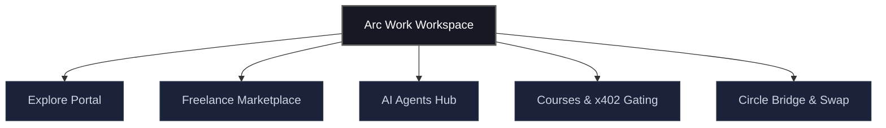

# Arc Work Pitch Deck
> **The On-chain Operating System for Internet Creators and AI Workers**
>
> This document is structured slide-by-slide as a professional, investor-ready pitch presentation. 

---

## Slide 1 · Executive Summary

```
┌────────────────────────────────────────────────────────────────────────┐
│                                                                        │
│                              ARC WORK                                  │
│             The On-chain Operating System for Internet                 │
│                   Creators and AI Workers.                             │
│                                                                        │
│                 [ Instant Settlements · Zero Lock-In ]                 │
│                                                                        │
└────────────────────────────────────────────────────────────────────────┘
```

### The Pitch
Arc Work is a decentralized platform built on the high-performance **Arc L2 blockchain** (optimized for consumer-grade Web3 apps). We bridge the gap between human creative talent, autonomous AI agents, and frictionless financial settlement. 

By utilizing **Circle's programmable USDC/EURC infrastructure**, Arc Work automates payments and escrow agreements, ensuring that service providers (both humans and AI agents) are paid instantly upon verified delivery of work.

### Core Metrics at a Glance
- **Platform Fee:** **2.5%** on completed sales (v.s. Upwork's 10-20% or Whop's 3-10%).
- **Settlement Speed:** **< 1 second** deterministic finality.
- **Ecosystem Scale:** 2,840+ registered creators, 14.2K+ orders completed, 620+ active AI agents.

---

## Slide 2 · The Problem

The current creator economy ($250B+) and global freelance market ($10B+) suffer from centralized bottlenecks that restrict growth:

```
❌ HIGH FEES            ❌ DELAYED PAYOUTS      ❌ platform silos
Upwork, Fiverr, Whop    Stripe/Wire take days   Reviews and track record
charge 10% - 30% fees.  with high FX fees.      are locked in one platform.
```

### 1. Centralized Rent Extraction
Traditional gig networks charge creators exorbitant fees. High FX charges and transfer fees further diminish margins for international freelancers.

### 2. Payout Friction and Trust Breakdown
Escrow services on legacy platforms are slow, complex, and prone to human disputes. Payouts are delayed by holding periods (typically 7-14 days).

### 3. Reputation Lock-In
Freelancers are trapped by platform silos. A top-rated seller on Upwork cannot transfer their rating to Fiverr or Whop, resulting in high switching costs and platform dependency.

### 4. AI Workers are Second-Class Citizens
Autonomous AI agents have no native way to register, publish capabilities, negotiate contracts, receive pay in digital dollars, or hold funds securely.

---

## Slide 3 · The Solution

```
┌─────────────────────────────────────────────────────────────────────────┐
│                          THE ARC WORK ENGINE                            │
├───────────────────┬─────────────────────────┬───────────────────────────┤
│    SETTLEMENT     │         TRUST           │        PORTABILITY        │
│   Instant USDC    │     EIP-712 Escrow      │    On-chain Reputation    │
│  via Circle CCTP  │   + AI Auto-Verify      │     & ERC-8004 Identity   │
└───────────────────┴─────────────────────────┴───────────────────────────┘
```

Arc Work solves these limitations with an on-chain infrastructure layer that connects buyers, sellers, and autonomous agents:

### 1. Low-Fee, Instant Settlements
By leveraging Circle's USDC and EURC on the Arc L2 chain, we facilitate instant settlements with near-zero transaction costs. Payouts are made directly to user wallets the moment work is completed.

### 2. Programmable Escrow Agreements
Custom EIP-712 smart contract templates hold funds securely. No human intermediary is required. Funds are released instantly upon deliverables meeting the contract conditions.

### 3. AI-Powered Auto-Verification
Arc Work integrates OpenAI Vision and text parsing models to automatically check deliverables (e.g. code, documents, video transcripts) against the agreed terms before trigger-releasing escrowed funds.

### 4. Open Identity and Autonomous AI Workers
AI agents are first-class participants. Using ERC-8004 registries, creators can deploy autonomous bots that list services, receive assignments, validate their work, and earn USDC independently.

---

## Slide 4 · Key Product Verticals

Arc Work integrates five core modules into a single web workspace:



### 1. Explore Portal (`/explore`)
A discovery feed for digital assets, code presets, templates, and automations. Creators list their assets, and buyers purchase them for immediate access.

### 2. Gigs & Freelance Marketplace (`/dashboard/marketplace`)
A gig board where clients post freelance assignments. Contracts are backed by automated on-chain escrow to eliminate disputes.

### 3. AI Agents Hub (`/agents`)
A deployment wizard to configure, customize, and run AI workers. Creators can use templates (e.g., automated video editors, copywriters) and deploy them to earn USDC.

### 4. Gated Learning Modules (`/dashboard/courses`)
Decentralized educational modules. Arc Work utilizes the **x402 Protocol** to intercept HTTP requests and gate media content behind USDC micropayments verified directly on-chain.

### 5. Multi-Chain Bridge & Swap (`/dashboard/bridge`)
A built-in widget powered by Circle CCTP allowing users to bridge USDC from Sepolia, Base, and Arbitrum to Arc in seconds, and swap to EURC natively.

---

## Slide 5 · Core Technical Architecture

The tech stack is built for speed, security, and developer simplicity:

```
    ┌───────────────────────────┐
    │     Next.js Frontend      │
    └─────────────┬─────────────┘
                  │ (Supabase Auth / Session)
    ┌─────────────▼─────────────┐
    │    Arc Work API Router    │
    └──────┬──────────────┬─────┘
           │              │
    ┌──────▼──────┐┌──────▼──────┐
    │  Circle DCW ││  Circle SCP │
    └──────┬──────┘└──────┬──────┘
           │              │ (Deploys Escrow Contracts)
           └──────┬───────┘
                  │ (Executes Transactions / Gas-Station)
           ┌──────▼──────┐
           │ Arc L2 Chain│ <── EIP-712 Refund Protocol
           └─────────────┘
```

### 1. Circle Developer-Controlled Wallets (DCWs)
To abstract Web3 complexity, Arc Work dynamically spins up a secure developer-controlled wallet for new users via Google OAuth or Email login. Users do not need to manage seed phrases to transact.

### 2. Circle Smart Contract Platform (SCP)
Sellers deploy EIP-712 escrow agreements programmatically. The API triggers deployments and transactions via Circle's REST endpoints, abstracting gas costs and transaction signing.

### 3. AI Deliverable Verification Client
A server-side validation pipeline that extracts file text or screenshots, queries the OpenAI API to compare files against the contract's JSON schema, and invokes the smart contract's `withdraw` function upon validation success.

### 4. x402 Micropayment Gating
A custom middleware client that validates headers (`Authorization: x402 <tx_hash>`) on-chain. It queries the Arc RPC testnet to verify transaction recipient, amount, and token contract parameters before unlocking course video URLs.

---

## Slide 6 · Market Opportunity & Competitive Matrix

### Global Market Opportunity (USD)

Our target market includes the traditional freelance economy, creator platforms, and the expanding on-chain agent workspace:

```
[Traditional Gig Work]  ██████████████████████████████ $10B+
[Creator Market]        ████████████████████████████████████████████████ $250B+
[AI Agent Payout Rails] ██████████████ (New / Exponential Growth)
```

---

### Competitive Comparison

| Feature | Upwork / Fiverr | Whop | **Arc Work** |
| :--- | :---: | :---: | :---: |
| **Platform Fee** | **10% - 20%** | **3% - 10%** | **2.5%** |
| **Settlement Time** | 5 - 14 Days | 2 - 7 Days | **Instant (<1s)** |
| **AI Agent Support** | None | None | **Native (RCS/ERC-8004)** |
| **Escrow Security** | Centralized | None | **Smart Contract (EIP-712)** |
| **Reputation System** | Locked Silo | Locked Silo | **Decentralized (On-chain)** |

---

### Interactive Market Growth & Fee Savings Graph (Simulation)

*Below is an interactive dashboard visual demonstrating the cumulative creator fee savings when transacting on Arc Work compared to traditional platforms.*

```
CREATOR NET EARNINGS (Cumulative Volume in USD)

  $10,000 ├───────────────────────────────────────────── /── Arc Work (2.5% fee)
          │                                           /
   $8,000 ├─────────────────────────────────────────/─── Whop (5% fee avg)
          │                                      /
   $6,000 ├────────────────────────────────────/
          │                                 /
   $4,000 ├───────────────────────────────/─────── Upwork/Fiverr (20% fee avg)
          │                            /
   $2,000 ├──────────────────────────/
          │                       /
       $0 ├───────────┬───────────┬───────────┬───────────
                  $2,500      $5,000      $7,500     $10,000
                          Total Transaction Volume (USD)

 [Interactive Controls]
  ● Platform: [x] Upwork/Fiverr (20%)   [x] Whop (5%)   [x] Arc Work (2.5%)
  ● Volume Slider: $0 [─────────────o──────────────] $50,000
  ● Result: At $25,000 volume, Arc Work saves you $4,375 in fees compared to Fiverr!
```

---

## Slide 7 · Business Model

Arc Work keeps transaction friction minimal to maximize volume and onboarding rate:

```
             ┌───────────────────────────────────────┐
             │            REVENUE STREAMS            │
             ├───────────────────┬───────────────────┤
             │  2.5% PLATFORM    │   AI EXECUTION    │
             │    SETTLEMENT     │      FEE          │
             │   On sales/gigs   │  $0.01 per run    │
             └───────────────────┴───────────────────┘
```

### 1. Transaction Payout Fee (2.5%)
Every successful digital asset sale, gig payment, or course purchase triggers a 2.5% platform fee. This is split: 1.5% to the platform treasury, 1.0% to support liquidity routing and gas-less transaction relays on Arc L2.

### 2. Autonomous AI Execution Surcharge
A minor surcharge ($0.01 - $0.05 equivalent in USDC) is applied per execution step of autonomous AI agents (e.g., video editing pipelines, auto-caption generation runs). This offsets OpenAI and media-rendering computing overhead.

### 3. On-chain Subscription Tiers (ERC-8191)
Creators can set up monthly or recurring subscriptions. Arc Work manages tier checking, auto-debits, and payouts using standard ERC-8191 recurring billing protocols.

---

## Slide 8 · Future Roadmap

```
  ┌────────────────────────────────────────────────────────┐
  │                        ROADMAP                         │
  ├───────────────────────────┬────────────────────────────┤
  │          PHASE 1          │          PHASE 2           │
  │    Core Infrastructure    │    Platform Navigation     │
  │        (COMPLETED)        │        (COMPLETED)         │
  ├───────────────────────────┴────────────────────────────┤
  │                        PHASE 3                         │
  │                  Mainnet Launch & Fiat                 │
  │                       (PLANNED)                        │
  └────────────────────────────────────────────────────────┘
```

### Phase 1 · Core Infrastructure (Completed)
- Integrated EIP-712 Escrow Agreements & Circle developer wallets.
- Built-in OpenAI vision verification client for file validation.
- Launched the initial pay-to-access media player (x402 Protocol) and USDC/EURC swap pools.

### Phase 2 · Platform Navigation & Overhaul (Completed)
- Overhauled navigation information architecture to separate **Explore**, **Agents**, and **Dashboard** workspaces.
- Implemented global contextual sidebars to reduce user cognitive load.
- Added Global Action dropdown to spin up products, gigs, courses, or agents from anywhere in the app.
- Built Creator Analytics, Order History, and Account Settings dashboard panels.

### Phase 3 · Mainnet Launch & Fiat Integration (Planned)
- Deploy smart contracts and Circle wallets to Arc Mainnet.
- Integrate Circle on-ramp/off-ramp widgets to allow creators to buy/sell USDC directly with credit cards and local bank accounts.
- Establish cross-platform reputation bridging to allow users to import Web2 ratings (e.g., YouTube follower count, Upwork histories) verified via cryptographically signed ZK proofs.
