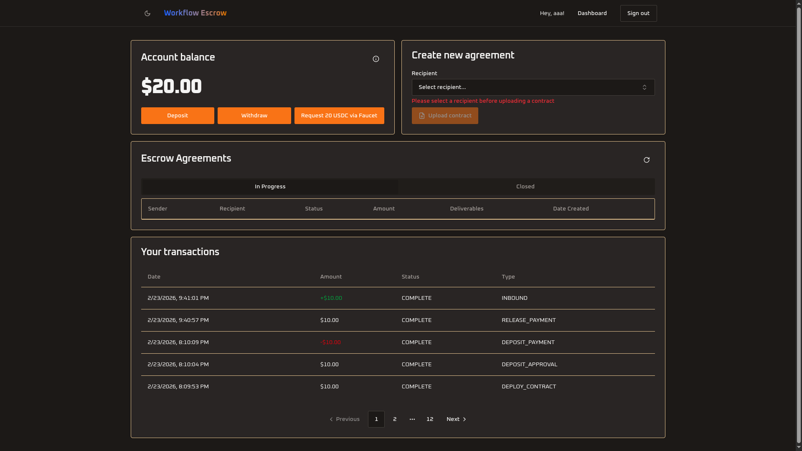

# Workflow Escrow Refund Protocol

Automate escrow-backed freelance agreements with AI-powered work validation using USDC on Arc testnet. This sample application uses Next.js, Supabase, Circle Developer Controlled Wallets, and OpenAI to demonstrate an end-to-end escrow workflow — from contract creation and deposit, through AI-validated deliverable submission, to fund release or refund.



## Table of Contents

- [Prerequisites](#prerequisites)
- [Getting Started](#getting-started)
- [Bridge & Swap](#bridge--swap)
- [How It Works](#how-it-works)
- [Environment Variables](#environment-variables)
- [User Accounts](#user-accounts)

## Prerequisites

- **Node.js v22+** — Install via [nvm](https://github.com/nvm-sh/nvm)
- **Supabase CLI** — Install via `npm install -g supabase` or see [Supabase CLI docs](https://supabase.com/docs/guides/cli/getting-started)
- **Docker Desktop** (only if using the local Supabase path) — [Install Docker Desktop](https://www.docker.com/products/docker-desktop/)
- **[ngrok](https://ngrok.com/)** — For local webhook testing
- Circle Developer Controlled Wallets **[API key](https://console.circle.com/signin)** and **[Entity Secret](https://developers.circle.com/wallets/dev-controlled/register-entity-secret)**
- **[OpenAI API key](https://platform.openai.com/api-keys)** — Used for AI-powered work validation
- **MetaMask** (or any EVM wallet) — For browser-based bridging and swapping

## Getting Started

1. Clone the repository and install dependencies:

   ```bash
   git clone git@github.com:akelani-circle/workflow-escrow-refund-protocol.git
   cd workflow-escrow-refund-protocol
   npm install
   ```

2. Set up environment variables:

   ```bash
   cp .env.example .env.local
   ```

   Then edit `.env.local` and fill in all required values (see [Environment Variables](#environment-variables) section below). Leave `NEXT_PUBLIC_AGENT_WALLET_ID`, `NEXT_PUBLIC_AGENT_WALLET_ADDRESS`, and `CIRCLE_BLOCKCHAIN` blank — they will be auto-generated in the next step.

3. Generate the agent wallet:

   ```bash
   npm run generate-wallet
   ```

   This creates a Circle developer-controlled wallet and writes the wallet ID, address, and blockchain values into your `.env.local`.

4. Set up the database — Choose one of the two paths below:

   <details>
   <summary><strong>Path 1: Local Supabase (Docker)</strong></summary>

   Requires Docker Desktop installed and running.

   ```bash
   npx supabase start
   npx supabase migration up
   ```

   The output of `npx supabase start` will display the Supabase URL and API keys needed for your `.env.local`.

   </details>

   <details>
   <summary><strong>Path 2: Remote Supabase (Cloud)</strong></summary>

   Requires a [Supabase](https://supabase.com/) account and project.

   ```bash
   npx supabase link --project-ref <your-project-ref>
   npx supabase db push
   ```

   Retrieve your project URL and API keys from the Supabase dashboard under **Settings → API**.

   </details>

5. Start the development server:

   ```bash
   npm run dev
   ```

   The app will be available at `http://localhost:3000`.

6. Set up Circle Webhooks (for local development):

   In a separate terminal, expose your local server:

   ```bash
   ngrok http 3000
   ```

   Copy the HTTPS URL from ngrok and configure a webhook in the Circle Console:
   - Navigate to [Circle Console → Webhooks](https://console.circle.com/webhooks)
   - Add a new webhook endpoint: `https://your-ngrok-url.ngrok.io/api/webhooks/circle`
   - Keep ngrok running while developing to receive webhook events

## Bridge & Swap

The dashboard includes a **Bridge & Swap** page (`/dashboard/bridge`) powered by the [Circle App Kit SDK](https://docs.arc.io/app-kit) and [Reown AppKit](https://reown.com/appkit) for browser wallet integration.

### Bridge (USDC → Arc Testnet)

Move USDC from EVM testnets to Arc Testnet via Circle's Cross-Chain Transfer Protocol (CCTP):

1. Connect your MetaMask wallet.
2. Select a source chain: **Ethereum Sepolia**, **Base Sepolia**, or **Arbitrum Sepolia**.
3. Enter the amount of USDC to bridge.
4. Click **Bridge to Arc** — the app will automatically prompt your wallet to switch to the selected source chain if needed, then orchestrate the `approve` + `burn` transactions.
5. USDC arrives on Arc Testnet in under 1 second with deterministic finality.

**Supported source chains:**

| Chain | Chain ID |
|---|---|
| Ethereum Sepolia | 11155111 |
| Base Sepolia | 84532 |
| Arbitrum Sepolia | 421614 |

### Swap (on Arc Testnet)

Swap tokens natively on Arc Testnet (e.g., USDC ↔ EURC):

1. Switch your wallet to **Arc Testnet** (Chain ID: `5042002`, RPC: `https://rpc.testnet.arc.network`).
2. Select **From Token** and **To Token** (USDC or EURC).
3. Enter the amount and click **Swap Tokens**.
4. The app fetches a swap quote from Circle's API via our server-side `/api/swap` route (to avoid CORS restrictions).
5. The quote includes a pre-built transaction via the **Fly DEX** on Arc Testnet — your wallet is prompted to `approve` spending and execute the swap.
6. On success, a link to the transaction on [ArcScan](https://testnet.arcscan.app) is shown.

> **Note:** Swapping requires a Circle **Kit Key** (`KIT_KEY:...`), which is separate from the Circle API Key. Get a free Kit Key at [developers.circle.com/w3s/keys#kit-keys](https://developers.circle.com/w3s/keys#kit-keys).

**Token contract addresses on Arc Testnet:**

| Token | Contract Address |
|---|---|
| USDC | `0x3600000000000000000000000000000000000000` |
| EURC | `0x89B50855Aa3bE2F677cD6303Cec089B5F319D72a` |

### Architecture Notes

- **Bridge**: Uses `@circle-fin/app-kit` + `@circle-fin/adapter-viem-v2` with the user's connected wallet via `createViemAdapterFromProvider`. Orchestrates `approve` + `burn` via Circle's CCTP.
- **Swap quote**: Fetched server-side via `/api/swap` (Next.js API route). Circle's API blocks the browser `x-user-agent` header via CORS, so all swap API calls go through the server. The route resolves token aliases to Arc Testnet contract addresses and converts amounts to base units (6 decimals).
- **Swap execution**: After the quote is fetched, `kit.swap()` uses the connected wallet adapter to prompt MetaMask for `approve` + swap transaction signing.
- **Automatic network switching**: Clicking Bridge or Swap triggers `switchNetwork()` via Reown AppKit if the wallet is on the wrong chain — no manual network changes needed.
- **Arc Testnet** is registered as a custom chain in the AppKit provider (`lib/web3/appkit-provider.tsx`) with RPC `https://rpc.testnet.arc.network`.
- **CORS proxy** (generic): A catch-all proxy at `/api/circle-proxy/[...path]` is also available to forward any Circle API request server-side.

## How It Works

- Built with [Next.js](https://nextjs.org/) and [Supabase](https://supabase.com/)
- Uses [Circle Developer Controlled Wallets](https://developers.circle.com/wallets/dev-controlled) for USDC escrow transactions on Arc testnet
- Smart contracts (EIP-712 Refund Protocol) deployed and managed via `@circle-fin/smart-contract-platform`
- [OpenAI](https://platform.openai.com/) validates submitted work deliverables against agreement criteria using vision models
- Webhook signature verification ensures secure transaction notifications
- Agent wallet automatically initialized via the `generate-wallet` script
- Real-time UI updates powered by Supabase Realtime subscriptions

## Environment Variables

Copy `.env.example` to `.env.local` and fill in the required values:

```bash
# Deployment URL
VERCEL_URL=http://localhost:3000
NEXT_PUBLIC_VERCEL_URL=http://localhost:3000

# Supabase
NEXT_PUBLIC_SUPABASE_URL=
NEXT_PUBLIC_SUPABASE_ANON_KEY=

# USDC Smart Contract
NEXT_PUBLIC_USDC_CONTRACT_ADDRESS=

# Agent Wallet (auto-generated by npm run generate-wallet)
NEXT_PUBLIC_AGENT_WALLET_ID=
NEXT_PUBLIC_AGENT_WALLET_ADDRESS=

# Circle
CIRCLE_API_KEY=
CIRCLE_ENTITY_SECRET=
CIRCLE_BLOCKCHAIN=

# OpenAI
OPENAI_API_KEY=

# Google sign-in
GOOGLE_CLIENT_ID=
GOOGLE_CLIENT_SECRET=

# Circle App Kit — required for Swap feature
# Get a free Kit Key at: https://developers.circle.com/w3s/keys#kit-keys
NEXT_PUBLIC_CIRCLE_KIT_KEY=KIT_KEY:<keyId>:<keySecret>
```

| Variable | Scope | Purpose |
| --- | --- | --- |
| `VERCEL_URL` | Server-side | Base URL of the deployment (e.g., `http://localhost:3000`). |
| `NEXT_PUBLIC_VERCEL_URL` | Public | Public-facing base URL for client-side usage. |
| `NEXT_PUBLIC_SUPABASE_URL` | Public | Supabase project URL. |
| `NEXT_PUBLIC_SUPABASE_ANON_KEY` | Public | Supabase anonymous/public key. |
| `NEXT_PUBLIC_USDC_CONTRACT_ADDRESS` | Public | USDC token contract address on the target blockchain. |
| `NEXT_PUBLIC_AGENT_WALLET_ID` | Public | Circle wallet ID for the escrow agent. Auto-generated. |
| `NEXT_PUBLIC_AGENT_WALLET_ADDRESS` | Public | Wallet address for the escrow agent. Auto-generated. |
| `CIRCLE_API_KEY` | Server-side | Circle API key for wallet and contract operations. |
| `CIRCLE_ENTITY_SECRET` | Server-side | Circle entity secret for signing transactions. |
| `CIRCLE_BLOCKCHAIN` | Server-side | Blockchain network identifier (e.g., `ARC-TESTNET`). Auto-generated. |
| `OPENAI_API_KEY` | Server-side | OpenAI API key for AI-powered work validation. |
| `NEXT_PUBLIC_CIRCLE_KIT_KEY` | Public | Circle Kit Key for App Kit swap/bridge features. Format: `KIT_KEY:<id>:<secret>`. |

## User Accounts

### Default Account

On first visit, sign up with any email and password. The first user created can act as both a depositor (client) and a beneficiary (freelancer) across different agreements.

### Signup Rate Limits

Supabase limits email signups to **2 per hour** by default (unless custom SMTP is configured). If you hit an "email rate limit exceeded" error during testing:

- **Local Supabase (Docker):** Email verification is handled by the built-in [Inbucket](http://127.0.0.1:54324) mail server — check it to confirm signups. The rate limit can be adjusted in `supabase/config.toml` under `[auth.rate_limit]`.
- **Remote Supabase (Cloud):** Use real email addresses (disposable emails may fail verification). If you hit the limit, you can manually add users via the Supabase dashboard under **Authentication → Users**.

## Security & Usage Model

This sample application:
- Assumes testnet usage only
- Handles secrets via environment variables
- Verifies webhook signatures for security
- Is not intended for production use without modification
