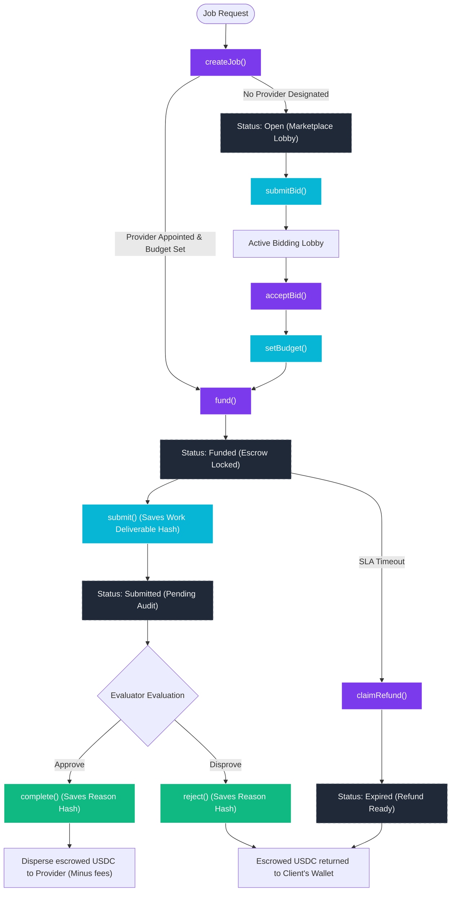

# Smart Contract Workflow & API Architecture

This document provides a visual mapping of the job lifecycle and detailed specifications of all view and tracking functions within the upgraded `AgenticCommerce` smart contract.

---

## 📊 Contract Workflow Diagram

The flowchart below visualizes the complete state transitions from job creation, through the bidding lobby, into escrow funding, and ultimately to payment release or refund settlement.

---

## 🔍 On-Chain Read Functions (API Details)

The upgraded contract includes optimized read pathways to feed the frontend dashboards, reducing RPC query roundtrips and avoiding manual block log parsing.

### 1. Relation Trackers (Dashboard Feeds)

| Read Signature | Return Type | Description / Purpose | UX Impact |
| :--- | :--- | :--- | :--- |
| `getClientJobs(address client)` | `uint256[]` | Returns an array of all Job IDs created by the specified client address. | Feeds the "As Client" quick-access dashboard. |
| `getProviderJobs(address provider)` | `uint256[]` | Returns an array of all Job IDs assigned to or bid on by the provider. | Feeds the "As Provider" actions board. |
| `getEvaluatorJobs(address evaluator)` | `uint256[]` | Returns an array of all Job IDs monitored by the specified evaluator. | Feeds the "As Evaluator" auditing dashboard. |

### 2. State & Parameter Inspection

| Read Signature | Return Type | Description / Purpose | UX Impact |
| :--- | :--- | :--- | :--- |
| `getJob(uint256 jobId)` | `Job (Struct)` | Returns the core details: `id`, `client`, `provider`, `evaluator`, `description`, `budget`, `expiredAt`, `status` (0-5), `hook`. | Populates the Explorer details card. |
| `jobDeliverables(uint256 jobId)` | `bytes32` | Returns the `keccak256` hash of the deliverable submitted by the provider. | Displays deliverable attestation on the main card once work is submitted. |
| `jobReasons(uint256 jobId)` | `bytes32` | Returns the `keccak256` hash of the resolution reason submitted by the evaluator. | Displays approval attestation or quality rejection reasons. |

### 3. Marketplace & System Analytics

| Read Signature | Return Type | Description / Purpose | UX Impact |
| :--- | :--- | :--- | :--- |
| `getBids(uint256 jobId)` | `Bid[] (Array of Structs)` | Returns all submitted offers for an open job, including `provider`, `amount`, and `accepted` status. | Renders the Active Bidding Lobby with offer cards and "Accept Offer" buttons. |
| `getPlatformStats()` | `(uint256 totalJobs, uint256 totalEscrowed)` | Returns the total count of jobs created and total USDC volume routed through the escrow protocol. | Displays global metrics in the active setup sidebar. |
